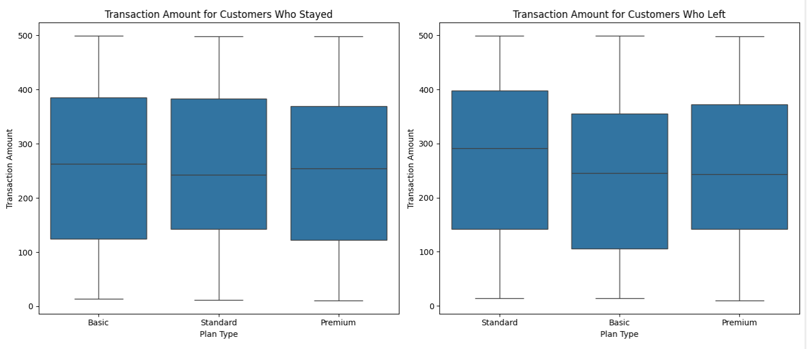
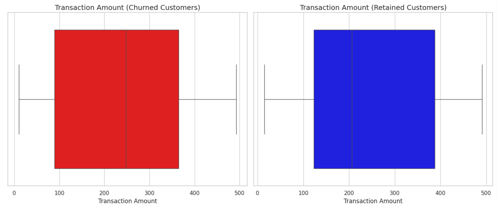
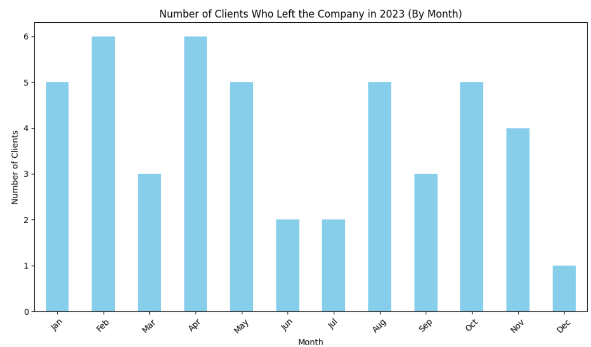

## Customer-Churn-Classification
Atidot - DS Assignment 

In this Assignment, I will present a robust classification model that predicts which customers will churn between

Jan. 1, 2024 and Feb. 28, 2024, using time-series data with a double index (customer_id and date).

Demonstrate modeling and feature engineering skills, as well as production-aware design practices.

The data set contains the following features :

1.**customer_id**

2.**date** from 1.1.2023 until the end of the year. (date feature)

3.**transaction_amount**	(numerical feature)

4.**plan_type**: Basic, Strandrad, Premium (categorical feature) 

5.**churn**	(1= The customer leaves the company, 0= The customer stays  the company)

6.**issuing_date** When the customer buys the insurance.

I start by filling NaN in the data set by the following role, replacing Nan for each customer by the mean of the transaction_amount with the same plan_type.

For example 

| customer_id | date                   | transaction_amount | plan_type | churn | issuing_date          |
|------------|------------------------|--------------------|-----------|-------|------------------------|
| CUST_1     | 2023-01-01 00:00:00     | 193.5246582        | Basic     | 0     | 2021-03-01 00:00:00     |
| CUST_1     | 2023-02-01 00:00:00     | 303.3426573        | Standard  | 0     | 2021-03-01 00:00:00     |
| CUST_1     | 2023-03-01 00:00:00     | 38.46096996        | Standard  | 0     | 2021-03-01 00:00:00     |
| CUST_1     | 2023-04-01 00:00:00     | 356.9555631        | Premium   | 0     | 2021-03-01 00:00:00     |
| CUST_1     | 2023-05-01 00:00:00     | 417.896894         | Standard  | 0     | 2021-03-01 00:00:00     |
| CUST_1     | 2023-06-01 00:00:00     | **NaN**            | Premium   | 0     | 2021-03-01 00:00:00     |
| CUST_1     | 2023-07-01 00:00:00     | 221.6530591        | Standard  | 0     | 2021-03-01 00:00:00     |
| CUST_1     | 2023-08-01 00:00:00     | 78.35199172        | Standard  | 0     | 2021-03-01 00:00:00     |
| CUST_1     | 2023-09-01 00:00:00     | 233.4742923        | Premium   | 0     | 2021-03-01 00:00:00     |
| CUST_1     | 2023-10-01 00:00:00     | 261.9748748        | Standard  | 1     | 2021-03-01 00:00:00     |
| CUST_1     | 2023-11-01 00:00:00     | 307.6969774        | Basic     | 1     | 2021-03-01 00:00:00     |

 **NaN** = (356.9555631 + 233.4742923 )/2
 
Then I Add three relevant date-dependent features : 

1. **date_mouth** : The mouth of the data.

2. **plan_changes**: When the customer changes is plan type ( 1=  the customer changes is plan type , 0= the customer did not changes is plan type )

3. **plan_changes_total_changes**: How many changes did he customer make in 2023

4. **date_minus_issuing_date**: The number of days between the data and issuing_date.

### Exploratory data analysis of the data frame

I start with the correlation matrix of the numerical features, and as we can see, there is no linear connection between the numerical features.

#### Corrlation Matrix

| Feature                      | transaction_amount | plan_changes_total_changes | date_minus_issuing_date |
|------------------------------|--------------------|---------------------------|-------------------------|
| **transaction_amount**        | 1.000000          | -0.034869                 | 0.003824                |
| **plan_changes_total_changes** | -0.034869         | 1.000000                  | 0.022887                |
| **date_minus_issuing_date**   | 0.003824          | 0.022887                  | 1.000000                |

#### Histogram of the date_minus_issuing_date belonging to the customers that leave the company 

![Alt text] (Plots/Histogram of the date_minus_issuing_date .png)

#### Box plot of transaction_amount for each plan type for customers that leave/stay in the company 

#### Box plot of transaction_amount and Statiscal Summary 

##### Summary of Transaction Amount  

<table>
  <tr>
    <th colspan="2">Churned Customers</th>
    <th colspan="2">Retained Customers</th>
  </tr>
  <tr>
    <td><b>Statistic</b></td><td><b>Value</b></td>
    <td><b>Statistic</b></td><td><b>Value</b></td>
  </tr>
  <tr>
    <td>Count</td><td>47</td>
    <td>Count</td><td>53</td>
  </tr>
  <tr>
    <td>Mean</td><td>232.45</td>
    <td>Mean</td><td>244.96</td>
  </tr>
  <tr>
    <td>Std Dev</td><td>154.67</td>
    <td>Std Dev</td><td>147.75</td>
  </tr>
  <tr>
    <td>Min</td><td>10.07</td>
    <td>Min</td><td>14.89</td>
  </tr>
  <tr>
    <td>25%</td><td>89.22</td>
    <td>25%</td><td>122.90</td>
  </tr>
  <tr>
    <td>50% (Median)</td><td>248.14</td>
    <td>50% (Median)</td><td>206.42</td>
  </tr>
  <tr>
    <td>75%</td><td>364.89</td>
    <td>75%</td><td>387.75</td>
  </tr>
  <tr>
    <td>Max</td><td>492.64</td>
    <td>Max</td><td>490.78</td>
  </tr>
</table>

#### Histogram of the customers who leave the company by mouth

#### Apply 3 models: Logistic regression, Random Forest, XGBOOST 

For model I split into training & testing sets (80% train, 20% test)
 
##### Logistic regression performance  : 

###### Accuracy  
**Accuracy:** 0.69  

###### Confusion Matrix  
| Actual \ Predicted | 0  | 1  |
|--------------------|----|----|
| **0** (Stay)      | 151 | 12 |
| **1** (Churn)     | 62  | 15 |

###### Classification Report

| Class               | Precision | Recall | F1-Score | Support |
|---------------------|-----------|--------|----------|---------|
| **0** (Stay)        | 0.71      | 0.93   | 0.80     | 163     |
| **1** (Churn)       | 0.56      | 0.19   | 0.29     | 77      |
| **Accuracy**        |           |        | 0.69     | 240     |
| **Macro Avg**       | 0.63      | 0.56   | 0.55     | 240     |
| **Weighted Avg**    | 0.66      | 0.69   | 0.64     | 240     |

###### Feature Importance  
| Feature                         | Coefficient  |
|---------------------------------|--------------|
| **date_mouth**                  | 0.790085     |
| **transaction_amount**          | 0.054664     |
| **plan_type_Premium**           | -0.013193    |
| **plan_type_Standard**          | -0.051589    |
| **plan_changes**                | -0.057033    |
| **plan_changes_total_changes**  | -0.193752    |
| **date_minus_issuing_date**     | -0.421579    |

##### Random Forest performance : 
 
###### Accuracy  
**Accuracy:** 0.74  

###### Confusion Matrix  
| Actual \ Predicted | 0  | 1  |
|--------------------|----|----|
| **0** (Stay)       | 145 | 18 |
| **1** (Churn)      | 45  | 32 |

###### Classification Report

| Class               | Precision | Recall | F1-Score | Support |
|---------------------|-----------|--------|----------|---------|
| **0** (Stay)        | 0.76      | 0.89   | 0.82     | 163     |
| **1** (Churn)       | 0.64      | 0.42   | 0.50     | 77      |
| **Accuracy**        |           |        | 0.74     | 240     |
| **Macro Avg**       | 0.70      | 0.65   | 0.66     | 240     |
| **Weighted Avg**    | 0.72      | 0.74   | 0.72     | 240     |

###### Feature Importance  
| Feature                         | Importance  |
|---------------------------------|-------------|
| **date_minus_issuing_date**     | 0.292386    |
| **transaction_amount**          | 0.276920    |
| **date_mouth**                  | 0.198031    |
| **plan_changes_total_changes**  | 0.155698    |
| **plan_type_Standard**          | 0.027657    |
| **plan_changes**                | 0.025918    |
| **plan_type_Premium**           | 0.023391    |

##### XGBOOST performance: 

###### Accuracy  
**Accuracy:** 0.75  

###### Confusion Matrix  
| Actual \ Predicted | 0  | 1  |
|--------------------|----|----|
| **0** (Stay)       | 140 | 23 |
| **1** (Churn)      | 36  | 41 |

###### Classification Report

| Class               | Precision | Recall | F1-Score | Support |
|---------------------|-----------|--------|----------|---------|
| **0** (Stay)        | 0.80      | 0.86   | 0.83     | 163     |
| **1** (Churn)       | 0.64      | 0.53   | 0.58     | 77      |
| **Accuracy**        |           |        | 0.75     | 240     |
| **Macro Avg**       | 0.72      | 0.70   | 0.70     | 240     |
| **Weighted Avg**    | 0.75      | 0.75   | 0.75     | 240     |

###### Feature Importance  
| Feature                         | Importance  |
|---------------------------------|-------------|
| **transaction_amount**          | 736.0       |
| **date_minus_issuing_date**     | 695.0       |
| **date_mouth**                  | 242.0       |
| **plan_changes**                | 37.0        |
| **plan_changes_total_changes**  | 358.0       |
| **plan_type_Premium**           | 61.0        |
| **plan_type_Standard**          | 96.0        |

